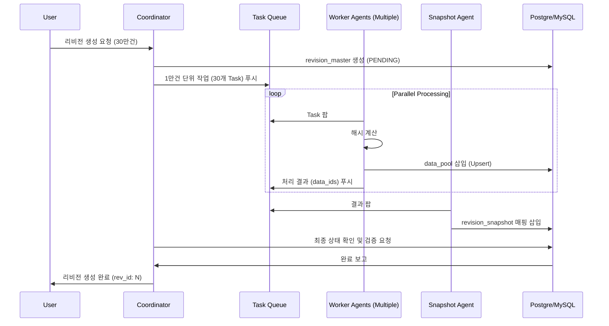

# 멀티에이전트 기반 리비전 처리 시스템 설계안

본 프로젝트는 30만 건 규모의 대용량 데이터 리비전 생성을 병렬로 처리하기 위해 다수의 에이전트가 협업하는 구조를 설계합니다.

## 핵심 목표
1. **병렬성**: 3만 건씩 10개의 청크로 나누어 에이전트들이 동시 처리.
2. **무결성**: 중복 데이터 방지 및 최종 데이터 수량 검증.
3. **상태 추적**: 각 단계별 진행 상황을 모니터링 가능하도록 구현.

## Proposed Changes

### 1. 스키마 확장 (Schema Update)
기존 `revision_master` 테이블에 에이전트 협업 상태를 위한 컬럼을 추가합니다.

- `status`: `PENDING`, `PROCESSING`, `COMPLETED`, `FAILED`
- `total_chunks`: 전체 작업 분할 수
- `processed_chunks`: 완료된 작업 분할 수
- `error_log`: 실패 시 원인 기록

### 2. 에이전트 역할 정의 (Agent Roles)

#### A. Coordinator Agent (조정자)
- **역할**: 작업을 생성하고 총괄합니다.
- **태스크**:
    - `revision_master` 레코드 생성 (Status: PENDING).
    - 데이터를 10,000~30,000건 단위의 Chunk로 분할.
    - 태스크 큐(Task Queue, 예: Redis)에 작업 투하.
    - 모든 에이전트의 완료 보고를 취합하여 최종 상태 업데이트.

#### B. Worker Agent (해시/삽입 처리자)
- **역할**: 실제 연산을 수행합니다.
- **태스크**:
    - 큐에서 Chunk를 가져옴.
    - `Payload`의 해시 계산.
    - `data_pool`에 `INSERT ... ON CONFLICT DO NOTHING` 수행.
    - 성공한 `data_id` 리스트를 결과 큐에 전송.

#### C. Snapshot Agent (매핑 관리자)
- **역할**: 리비전과 데이터 ID를 연결합니다.
- **태스크**:
    - Worker가 전달한 `data_id`들을 수집.
    - `revision_snapshot` 테이블에 Bulk Insert.
    - 이전 리비전에서 변경되지 않은 데이터들을 이어붙이는 `INSERT INTO ... SELECT` 수행.

#### D. Validation Agent (최종 검증자)
- **역할**: 결과의 정확성을 보장합니다.
- **태스크**:
    - 최종 스냅샷의 Row Count가 원본 요청 데이터 수와 일치하는지 확인.
    - 누락된 `data_id`나 해시 불일치 사례가 있는지 샘플링 검사.

## 작업 흐름 (Workflow Diagram)



## 에이전트 통신 규약 (Communication Spec)

에이전트들은 다음 JSON 포맷을 통해 소통합니다.

**[Task Message]**
```json
{
  "rev_id": 1024,
  "chunk_id": 5,
  "data": [ ... 1만건의 데이터 레코드 ... ]
}
```

**[Result Message]**
```json
{
  "rev_id": 1024,
  "chunk_id": 5,
  "status": "success",
  "mapped_ids": [12003, 12004, ... ]
}
```

## 향후 과제
- Redis 기반 분산 락 도입 계획.
- 에이전트 장애 시 재시도(Retry) 메커니즘 설계.

---

## 작업 계획
1. 위 내용을 바탕으로 `multi_agent_revision_design.md` 파일을 리포지토리에 생성합니다.
2. 기존 `revision_system_spec.md`에 상태 관리 컬럼 추가 가이드를 업데이트합니다.
